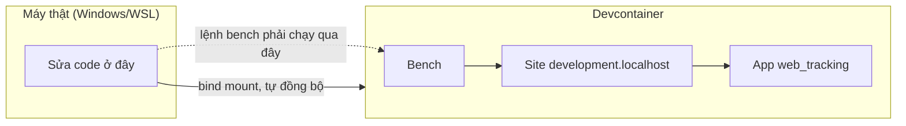
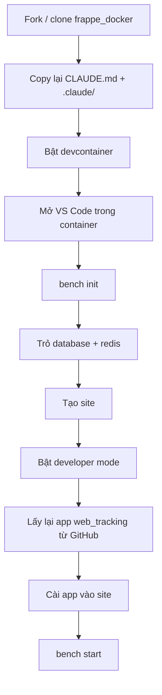

# Sổ tay Frappe — từ fork tới app chạy được

Tài liệu này gom lại toàn bộ kiến thức Frappe + quy trình dựng môi trường, để bạn dùng lại
khi xóa hết và bắt đầu lại từ đầu. Chỉ cần 3 thứ sống sót qua lần dọn dẹp: source app
`web_tracking`, file `CLAUDE.md`, và thư mục `.claude/skills/`.

> ⚠️ File này **không nằm trong danh sách 3 thứ cần giữ**. Nếu muốn giữ luôn, copy nó ra
> ngoài trước khi xóa, giống `CLAUDE.md`.

---

## 1. Khái niệm cơ bản

| Từ | Nghĩa đơn giản |
|---|---|
| **Frappe** | Bộ khung dựng app quản lý dữ liệu doanh nghiệp — tự sinh sẵn giao diện quản trị, API, phân quyền, không cần code từ đầu |
| **App** | Một gói tính năng cài thêm vào — giống plugin/addon. `web_tracking` là một app |
| **Site** | Một "công ty" độc lập chạy trên cùng bộ mã, dữ liệu riêng, không lẫn nhau |
| **Bench** | Công cụ dòng lệnh quản lý app + site (cài app, tạo site, chạy server...) |
| **DocType** | Một "loại dữ liệu" — giống một bảng trong Excel có cấu trúc. VD: `Web Tracking Lead` |
| **Developer mode** | Chế độ cho phép sửa DocType và tự ghi ra file để lưu vào git — **bắt buộc bật khi code** |
| **Container / Devcontainer** | Máy ảo nhẹ chứa sẵn Frappe + công cụ, chạy cách ly với máy thật (host) |
| **Image (Docker)** | Bản đóng gói cố định của toàn bộ app, dùng để chạy production — sau khi đóng gói thì **không sửa được nữa** |

---

## 2. Bức tranh tổng quan



**Ghi nhớ:** sửa file ở máy thật, nhưng mọi lệnh `bench` phải chạy **bên trong container**.

---

## 3. Trước khi xóa — giữ gì

| Cần giữ | Cách giữ | Vì sao |
|---|---|---|
| Source app `web_tracking` | **Không cần copy tay** — đã nằm trên GitHub tại `marcus-GLAC/web-tracking-frappe`, branch `main` | Đây là repo git riêng, sống độc lập với `frappe_docker` |
| `CLAUDE.md` | Copy file ra ngoài repo trước khi xóa | Chưa được git theo dõi trong `frappe_docker` |
| `.claude/skills/` + `skills-lock.json` | Copy cả thư mục ra ngoài trước khi xóa | Chưa được git theo dõi |

```bash
# chạy trên máy thật, trước khi xóa gì cả
mkdir -p ~/frappe-backup
cp /home/marcus/frappe_docker/CLAUDE.md ~/frappe-backup/
cp -r /home/marcus/frappe_docker/.claude ~/frappe-backup/
cp /home/marcus/frappe_docker/skills-lock.json ~/frappe-backup/
```

---

## 4. Dựng lại từ đầu



### Bước 1 — Fork và chuẩn bị (trên máy thật)

```bash
git clone https://github.com/<bạn>/frappe_docker.git
cd frappe_docker

cp -R devcontainer-example .devcontainer
cp -R development/vscode-example development/.vscode

# đặt lại CLAUDE.md và skills đã backup ở bước 3
cp ~/frappe-backup/CLAUDE.md .
cp -r ~/frappe-backup/.claude .
cp ~/frappe-backup/skills-lock.json .
```

Mở thư mục này trong VS Code → **Ctrl+Shift+P** → `Dev Containers: Reopen in Container`.
Các bước sau chạy trong **terminal của VS Code**, đã ở sẵn trong container.

### Bước 2 — Dựng bench

```bash
bench init --skip-redis-config-generation frappe-bench
cd frappe-bench
```

### Bước 3 — Trỏ đúng database và redis

```bash
bench set-config -g db_host mariadb
bench set-config -g redis_cache redis://redis-cache:6379
bench set-config -g redis_queue redis://redis-queue:6379
bench set-config -g redis_socketio redis://redis-queue:6379
```

### Bước 4 — Tạo site

```bash
bench new-site --mariadb-user-host-login-scope=% \
  --db-root-password 123 --admin-password admin \
  development.localhost
```

### Bước 5 — Bật developer mode (bắt buộc)

```bash
bench --site development.localhost set-config developer_mode 1
bench --site development.localhost clear-cache
```

Không có bước này, mọi thứ sửa qua giao diện web sẽ **không** ghi ra file — mất khi xóa container.

### Bước 6 — Lấy lại app `web_tracking`

```bash
bench get-app https://github.com/marcus-GLAC/web-tracking-frappe --branch main
bench --site development.localhost install-app web_tracking
```

### Bước 7 — Chạy thử

```bash
bench start
```

Mở `development.localhost:8000`, đăng nhập `Administrator` / mật khẩu bước 4.

---

## 5. Vòng lặp code hằng ngày

| Vừa sửa gì | Chạy lệnh gì |
|---|---|
| DocType (`.json`), `hooks.py`, patch | `bench --site development.localhost migrate` |
| Giao diện — JS/CSS trong `public/` | `bench build --app web_tracking` |
| Python thường, cần xóa cache | `bench --site development.localhost clear-cache` |
| Trước khi commit | `bench --site development.localhost run-tests --app web_tracking` |

Từ máy thật (ngoài container), thêm tiền tố:

```bash
docker exec -u frappe -w /workspace/development/frappe-bench \
  frappe_docker_devcontainer-frappe-1 bench <lệnh phía trên>
```

---

## 6. App `web_tracking` — tóm tắt

| | |
|---|---|
| Mục đích | Đồng bộ consent, lead, session, event từ script tracking trên website — dựng báo cáo marketing |
| Dữ liệu chính | Lead, Session, Event, Consent Log, Settings |
| Tự động | Cứ 10 phút đồng bộ dữ liệu 1 lần |
| Repo | `github.com/marcus-GLAC/web-tracking-frappe` (private), branch `main` |

---

## 7. Bẫy cần nhớ

| Tình huống | Vì sao xảy ra | Cách đúng |
|---|---|---|
| App không hiện trên màn hình chọn app | Icon lấy từ dữ liệu trong database, không tự cập nhật khi thêm cấu hình mới | Chạy lệnh tạo icon thủ công (xem `CLAUDE.md` mục 5.1) |
| Chạy production rồi mà thêm app không được | Production dùng bản đóng gói cố định (image), không cho sửa khi đang chạy | Đóng gói lại image mới rồi thay thế, không sửa trực tiếp |
| Custom Field / thiết lập tạo qua giao diện bị mất khi lên production | Những thứ này lưu trong database, không tự đi theo git | Khai báo trong `hooks.py` (`fixtures`) rồi xuất ra file trước khi lên production |
| Tên ảnh Docker bị từ chối khi build | Docker không chấp nhận chữ hoa trong tên | Luôn viết thường toàn bộ, VD `ghcr.io/marcus-glac/...` |

---

## 8. Bộ hỗ trợ AI đi kèm

| Thành phần | Vai trò |
|---|---|
| `CLAUDE.md` | Bản đồ dự án cho AI — container, site, app, quy tắc, cách chạy lệnh |
| `.claude/skills/frappe-app-dev` | Cẩm nang xây dựng app Frappe — DocType, API, hook, quyền, test |
| `.claude/skills/code-style` | Quy tắc viết code gọn, dễ đọc |
| `.claude/skills/quality-code-review` | Danh sách kiểm tra khi review code |
| `.claude/skills/technical-writing` | Quy tắc viết tài liệu ngắn gọn, dễ hiểu |
| `.claude/skills/ui-design` | Nguyên tắc thiết kế giao diện |

Các skill này đã ghim sẵn phiên bản trong `skills-lock.json` — không cần cài lại, chỉ cần copy
thư mục `.claude/` sang môi trường mới.

---

## 9. Cần chi tiết hơn?

Tài liệu này chỉ đủ để dựng lại và code hằng ngày. Phần đóng gói image, đưa app lên production,
và tự động hóa bằng GitHub Actions — xem `CLAUDE.md` mục 6 trở đi.
